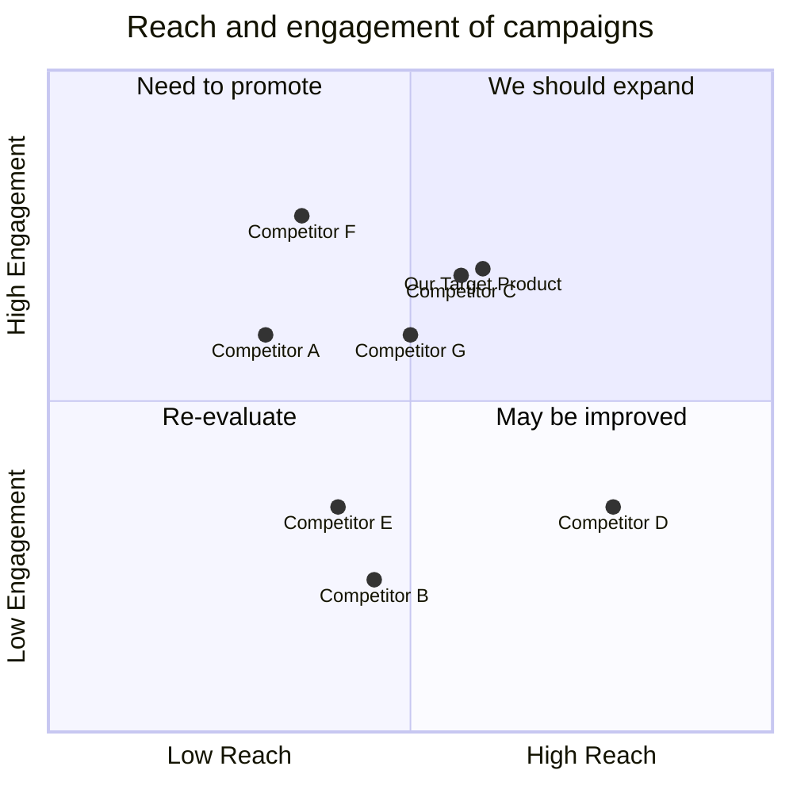

## Original Requirements:
The boss wants a CLI diary booking system that automatically calls and texts patients. When a patient agrees, the system should input the patient in the diary and move on to the next date to fill up the list.

## Product Goals:
- Create a CLI diary booking system that automates the process of calling and texting patients for appointments.
- Increase efficiency by automatically inputting patients into the diary when they agree to an appointment.
- Streamline the booking process by moving on to the next available date to fill up the appointment list.

## User Stories:
- As a user, I want to be able to easily schedule appointments with patients using a CLI interface.
- As a user, I want the system to automatically call and text patients for appointments, saving me time and effort.
- As a user, I want the system to automatically input patients into the diary when they agree to an appointment, reducing manual data entry.
- As a user, I want the system to intelligently move on to the next available date to fill up the appointment list, ensuring efficient scheduling.
- As a user, I want to be able to view and manage the appointment diary easily through the CLI interface.

## Competitive Analysis:
- Competitor A: Offers a web-based booking system with automated reminders but lacks a CLI interface.
- Competitor B: Provides a mobile app for booking appointments but does not have automated calling and texting features.
- Competitor C: Offers a comprehensive booking system with automated reminders and a mobile app, but lacks CLI functionality.
- Competitor D: Provides a CLI-based booking system but does not have automated calling and texting features.
- Competitor E: Offers a web-based booking system with automated reminders and a mobile app, but lacks CLI functionality.
- Competitor F: Provides a CLI-based booking system with automated reminders but does not have automated calling and texting features.
- Competitor G: Offers a comprehensive booking system with automated reminders, a mobile app, and a CLI interface.

## Competitive Quadrant Chart:


## Requirement Analysis:
The product should be a CLI diary booking system that automates the process of calling and texting patients for appointments. It should have the ability to input patients into the diary when they agree to an appointment and move on to the next available date to fill up the appointment list. The system should be efficient and user-friendly, allowing users to easily schedule, view, and manage appointments through the CLI interface.

## Requirement Pool:
```python
[
    ("Automated calling and texting of patients for appointments", "P0"),
    ("Automatic input of patients into the diary when they agree to an appointment", "P0"),
    ("Intelligent scheduling to move on to the next available date", "P0"),
    ("CLI interface for easy scheduling, viewing, and management of appointments", "P0"),
    ("Efficient and user-friendly system design", "P1")
]
```

## UI Design draft:
The CLI interface should have the following elements and functions:
- Main menu: Display options for scheduling, viewing, and managing appointments.
- Schedule appointment: Prompt the user to enter patient details and schedule an appointment.
- View appointments: Display a list of scheduled appointments with patient details.
- Manage appointments: Allow the user to edit or cancel existing appointments.
- Exit: Quit the CLI interface.

The style of the CLI interface should be clean and minimalistic, with clear prompts and instructions. The layout should be intuitive and easy to navigate, with clear separation between different sections.

## Anything UNCLEAR:
There are no unclear points.