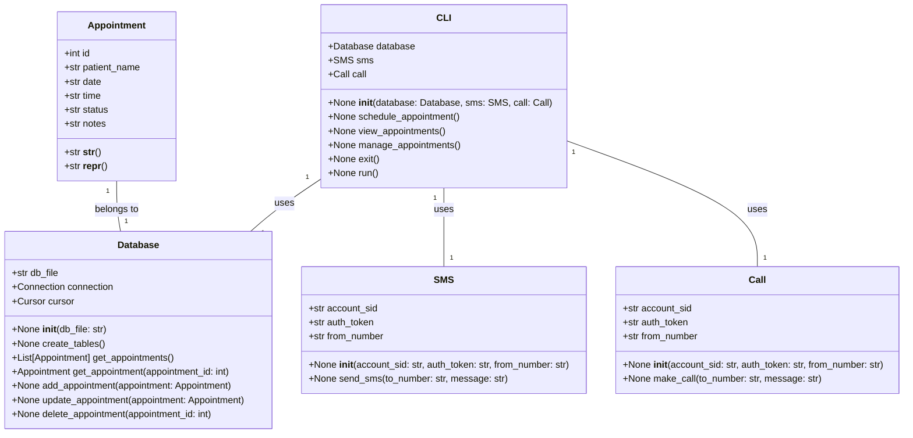
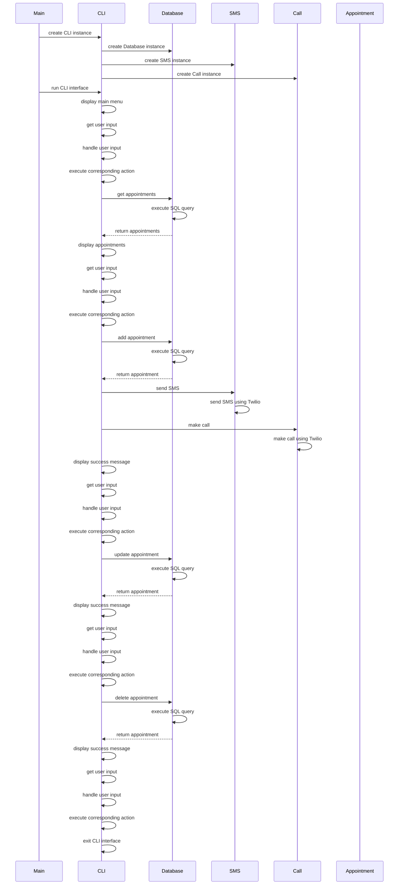

## Implementation approach:
For the implementation of the CLI diary booking system, we will use the following open-source tools:

1. Click: A Python package for creating beautiful command line interfaces. It provides an easy way to define command line options and arguments, as well as handling user input and displaying output.

2. Twilio: A Python package for sending SMS and making phone calls. We will use Twilio to automate the process of calling and texting patients for appointments.

3. SQLite: A lightweight, file-based database system that is easy to set up and use. We will use SQLite to store and manage the appointment diary.

4. Dateutil: A Python package for parsing and manipulating dates and times. We will use dateutil to intelligently schedule appointments and move on to the next available date.

## Python package name:
```python
"cli_diary_booking"
```

## File list:
```python
[
    "main.py",
    "cli.py",
    "database.py",
    "appointment.py",
    "sms.py",
    "call.py"
]
```

## Data structures and interface definitions:


## Program call flow:


## Anything UNCLEAR:
The requirements are clear to me.